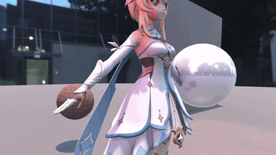

# Unity URP Shader — MyLit

一个基于 Unity URP 的自定义 PBR 着色器，实现了 **程序化点阵镂空（Dot Matrix Hatching）** 效果，支持 **法线贴图**、**金属度贴图**、**镜面反射贴图**、**粗糙度贴图**、**自发光**、**视差贴图**、**遮挡贴图** 和 **清漆（Clear Coat）** 效果。支持多种表面类型和面渲染模式，带有自定义材质编辑器。

---

## 🎬 效果展示

> 金属度工作流（`_Metalness` 0 → 1 循环扫描 + 相机环绕）



*镜头环绕 + 金属度参数实时扫描，展示金属度/非金属度过渡下的 PBR 光照、反射探针与阴影表现。*

---

## ✨ 特性

- **PBR 物理光照模型**：基于 URP 内置 `UniversalFragmentPBR`，支持主光源阴影、软阴影、级联阴影
- **附加光源支持**：完整的多光源前向渲染，支持附加光源阴影 (`_ADDITIONAL_LIGHTS` / `_ADDITIONAL_LIGHT_SHADOWS`)
- **反射探针**：支持反射探针混合与盒投影 (`_REFLECTION_PROBE_BLENDING` / `_REFLECTION_PROBE_BOX_PROJECTION`)
- **光源层级**：兼容 URP 光源层级系统 (`_LIGHT_LAYERS`)
- **屏幕空间遮挡**：支持屏幕空间环境光遮蔽 (`_SCREEN_SPACE_OCCLUSION`)
- **SSAO 修复**：已添加 `normalizedScreenSpaceUV` 赋值，SSAO 可正确采样
- **光照贴图烘焙**：完整支持 baked lightmap (`LIGHTMAP_ON` / `DIRLIGHTMAP_COMBINED` / `DYNAMICLIGHTMAP_ON`)，自动回退 SH 探针兜底
- **自发光参与 GI**：自发光贴图 + HDR 色调可参与光照烘焙 (`_EMISSION` 关键字 + `BakedEmissive` 标记)
- **双工作流支持**：
  - **金属度工作流**（默认）：金属度遮罩纹理 + 全局金属度系数，控制 F0 反射率
  - **镜面反射工作流**：镜面反射纹理 + 色调调节
- **法线贴图支持**：完整的 TBN 切线空间转换，可调节法线强度
- **粗糙度贴图**：支持粗糙度/平滑度遮罩纹理，与全局系数联动
- **自发光贴图**：支持 HDR 自发光色调，可驱动后处理 Bloom，带 Toggle 开关
- **视差贴图（Parallax Mapping）**：基于高度图的 UV 偏移采样，增加表面深度感
- **清漆效果（Clear Coat）**：支持清漆遮罩 + 强度 + 光滑度，模拟车漆/漆面多层反射
- **遮挡贴图（Occlusion Map）**：支持环境光遮蔽贴图（G 通道），带 Toggle 开关，可调节遮蔽强度
- **程序化点阵镂空**：通过数学计算在片元着色器中生成圆形点阵，实现半色调（halftone）镂空效果
- **多种表面类型**：
  - `Opaque` — 不透明
  - `TransparentCutout` — 透明裁切（点阵镂空）
  - `TransparentBlend` — 半透明混合
- **多种混合模式**（TransparentBlend 下可用）：
  - `Alpha` — 标准半透明
  - `Premultiplied` — 预乘半透明（玻璃效果）
  - `Additive` — 加法混合（提亮场景）
  - `Multiply` — 乘法混合（变暗场景）
- **面渲染模式**：
  - `FrontOnly` — 正面渲染（背面剔除）
  - `NoCulling` — 双面渲染，无法线翻转
  - `DoubleSided` — 双面渲染，自动翻转背面法线
- **Alpha 裁切**：可切换裁切阈值，镂空区域基于点阵密度动态计算
- **自定义材质检视面板**：下拉菜单控制 Surface Type / Blend Type / Face Rendering Mode，自动同步 Blend / ZWrite / Cull / Shader Keywords
- **SRP Batcher 兼容**：使用 `CBUFFER_START(UnityPerMaterial)` 包裹材质属性
- **DEBUG_DISPLAY 支持**：可配合 Unity 渲染调试器查看法线数据
- **多版本兼容**：支持 Unity 2021.3+ 和 2022+ 的 API 差异
- **光源 Cookie 支持**：支持主光源和附加光源 Cookie（`_MAIN_LIGHT_COOKIE` / `_ADDITIONAL_LIGHTS_COOKIE`），可实现百叶窗投影等效果
- **Shader Variant 优化**：使用 `shader_feature_local` / `shader_feature_local_fragment` 按需编译变体，减少包体

---

## 🛠 环境要求

| 项目 | 版本 |
|------|------|
| Unity | **2023.2.20f1** 或更高 |
| URP | **16.0.6** |
| 渲染管线 | Universal Render Pipeline |

---

## 📁 项目结构

```
Assets/
├── Docs/                          # 教程文档 & 交付文档
│   ├── Unity着色器教程/            # Unity 着色器教程（Part1-Part9 + 示例）
│   └── 项目交付文档.md             # 专家 AI 交付文档
├── Editor/
│   └── MyLitCustomInspector.cs    # 自定义材质编辑器
├── Material/
│   ├── MyLitSphere.mat            # MyLit 示例材质
│   ├── 东墩.mat / 北墩.mat / 南墩.mat / 西墩.mat  # 场景材质
│   ├── 天花板.mat / 底面.mat      # 场景材质
│   ├── 金属球.mat / 金属球lit.mat # 反射探针测试材质
│   └── ...
├── Models/                        # 3D 角色模型 + 材质
├── Scenes/
│   ├── SampleScene.unity          # 示例场景
│   └── SampleScene/               # 光照贴图 / 反射探针 / ShadowMask
├── Scripts/
│   └── AdditionalLightShadowController.cs # 附加光源阴影控制
├── Settings/                      # URP 设置资源
│   ├── URP-Balanced.asset         # URP Balanced 管线配置
│   ├── URP-HighFidelity.asset     # URP High Fidelity 管线配置
│   ├── URP-Performant.asset       # URP Performant 管线配置
│   └── ...                        # 渲染器 & Volume 配置文件
├── Shader/
│   ├── MaterialSphere.shader      # 反射探针测试用金属球 Shader（复用 URP Lit 的 ShadowCaster/DepthOnly/DepthNormals/Meta）
│   └── MyLit/
│       ├── MyLit.shader              # 主 Shader 文件（属性 + Pass 定义）
│       ├── MyLitCommon.hlsl          # 通用函数（点阵计算、Alpha 裁切）
│       ├── MyLitForwardLitPass.hlsl  # 前向光照通道（顶点 + 片元）
│       ├── MyLitShadowCasterPass.hlsl # 阴影投射通道
│       ├── MyLitDepthOnlyPass.hlsl   # 深度仅通道（DepthOnly）
│       ├── MyLitDepthNormalsPass.hlsl # 深度+法线通道（DepthNormals / SSAO）
│       └── MyLitMetaPass.hlsl        # 光照烘焙元通道（Meta / GI）
├── Textures/
│   ├── cat.png                    # 示例贴图
│   ├── metal/                     # Metal063 4K PBR 贴图组
│   │   ├── Metal063_4K-JPG_Color.jpg
│   │   ├── Metal063_4K-JPG_NormalGL.jpg
│   │   ├── Metal063_4K-JPG_Metalness.jpg
│   │   ├── Metal063_4K-JPG_Roughness.jpg
│   │   └── Metal063_4K-JPG_Displacement.jpg
│   ├── red_brick/                 # 红砖 4K PBR 贴图组
│   │   ├── red_brick_diff_4k.jpg
│   │   ├── red_brick_nor_gl_4k.exr
│   │   ├── red_brick_rough_4k.exr
│   │   └── red_brick_disp_4k.png
│   ├── rusty_metal/               # 锈金属 4K PBR 贴图组
│   │   ├── rusty_metal_05_diff_4k.jpg
│   │   ├── rusty_metal_05_nor_gl_4k.exr
│   │   ├── rusty_metal_05_rough_4k.exr
│   │   └── rusty_metal_05_disp_4k.png
│   └── 菴/                         # 角色贴图资源
└── _lighting/                     # 光照烘焙数据
```

---

## 🔧 使用方法

1. **导入项目**：克隆仓库后用 Unity 2023.2+ 打开
2. **应用 Shader**：创建 Material → Shader 选择 `Custom/MyLit`
3. **配置材质**：
   - 在 Inspector 中设置 **Surface Type** 和 **Face Rendering Mode**
   - 选择 `TransparentCutout` 时会显示 **Alpha Cutout Threshold** 滑条
   - 选择 `TransparentBlend` 时会显示 **Blend Type** 下拉菜单
   - 切换 **Use specular workflow** 可在金属度 / 镜面反射工作流之间切换
   - 启用 **Use roughness texture** 可激活粗糙度贴图采样
   - 切换 **自发光** Toggle 可启用自发光
   - 切换 **使用遮挡贴图** Toggle 可启用遮挡贴图采样
   - 调整 **Dot Density**（点阵密度）和 **Dot Radius**（点半径）控制镂空效果
   - 调整 **Dot Scale X/Y** 可拉伸 UV 方向的点阵形状
4. **分配贴图**：
   - **颜色贴图** → 主纹理（反照率）
   - **Normal** → 法线贴图
   - **Metalness mask** → 金属度遮罩纹理
   - **Specular map** → 镜面反射纹理（仅 Specular 工作流）
   - **Smoothness mask** → 平滑度/粗糙度遮罩纹理
   - **Emission map** → 自发光纹理
   - **Height/displacement map** → 视差高度图
   - **Clear coat mask** → 清漆遮罩纹理
   - **Clear coat smoothness mask** → 清漆光滑度遮罩纹理
   - **遮挡贴图** → 环境光遮蔽贴图（G 通道）
5. **调整参数**：
   - **Normal strength** — 控制法线凹凸程度
   - **Metalness** — 全局金属度系数
   - **Specular tint** — 镜面反射色调
   - **Smoothness** — 全局光滑度系数
   - **Emission tint** — HDR 自发光色调
   - **Parallax strength** — 视差偏移强度
   - **Clear coat strength** — 清漆强度
   - **Clear coat smoothness** — 清漆光滑度
   - **遮挡强度** — 环境光遮蔽强度
6. **应用到物体**：将 Material 拖拽到场景中的 Mesh Renderer 上

---

## 🎨 参数说明

### 基础参数

| 参数 | 类型 | 说明 |
|------|------|------|
| `颜色贴图` | 2D 贴图 | 主纹理（RGB = 反照率, A = 透明度） |
| `Tint` | Color | 颜色 tint，与纹理颜色相乘 |

### 工作流切换

| 参数 | 类型 | 说明 |
|------|------|------|
| `Use specular workflow` | Toggle | 开启后使用镜面反射工作流，关闭使用金属度工作流 |
| `Use roughness texture` | Toggle | 开启后启用粗糙度贴图采样 |

### 法线 & 视差

| 参数 | 类型 | 说明 |
|------|------|------|
| `Normal` | 2D 贴图 | 法线贴图（OpenGL 格式），凹凸细节来源 |
| `Normal strength` | Range(0, 1) | 法线强度，控制凹凸程度 |
| `Height/displacement map` | 2D 贴图 | 视差高度图，用于 UV 偏移采样 |
| `Parallax strength` | Range(0, 1) | 视差偏移强度 |

### 金属度工作流

| 参数 | 类型 | 说明 |
|------|------|------|
| `Metalness mask` | 2D 贴图 | 金属度遮罩纹理（R 通道控制金属度） |
| `Metalness` | Range(0, 1) | 全局金属度系数，与遮罩纹理相乘 |

### 镜面反射工作流

| 参数 | 类型 | 说明 |
|------|------|------|
| `Specular map` | 2D 贴图 | 镜面反射纹理 |
| `Specular tint` | Color | 镜面反射色调 |

### 光滑度 & 粗糙度

| 参数 | 类型 | 说明 |
|------|------|------|
| `Smoothness mask` | 2D 贴图 | 平滑度/粗糙度遮罩纹理 |
| `Smoothness` | Range(0, 1) | 全局光滑度系数（Roughness 模式下：贴图白=粗糙，黑=光滑） |

### 自发光

| 参数 | 类型 | 说明 |
|------|------|------|
| `自发光` | Toggle | 开启后启用自发光参与 GI 烘焙 |
| `Emission map` | 2D 贴图 | 自发光纹理 |
| `Emission tint` | Color (HDR) | HDR 自发光色调，可驱动 Bloom 后处理 |

### 清漆效果

| 参数 | 类型 | 说明 |
|------|------|------|
| `Clear coat mask` | 2D 贴图 | 清漆遮罩纹理 |
| `Clear coat strength` | Range(0, 1) | 清漆强度，>0 时启用清漆效果 |
| `Clear coat smoothness mask` | 2D 贴图 | 清漆光滑度遮罩纹理 |
| `Clear coat smoothness` | Range(0, 1) | 清漆光滑度系数 |

### 环境光遮蔽

| 参数 | 类型 | 说明 |
|------|------|------|
| `使用遮挡贴图` | Toggle | 开启后启用遮挡贴图采样 |
| `遮挡贴图` | 2D 贴图 | 环境光遮蔽贴图（G 通道控制遮蔽强度） |
| `遮挡强度` | Range(0, 1) | 遮蔽强度系数，0 = 无遮蔽，1 = 完全遮蔽 |

### 点阵镂空

| 参数 | 类型 | 说明 |
|------|------|------|
| `Dot Density` | Float | 点阵密度，值越大点越密集 |
| `Dot Radius` | Range(0, 0.5) | 每个点的半径大小 |
| `Dot Scale X` | Range(0.1, 5) | X 方向点阵拉伸 |
| `Dot Scale Y` | Range(0.1, 5) | Y 方向点阵拉伸 |
| `Alpha cutout threshold` | Range(0, 1) | 透明度裁切阈值（仅在 Cutout 模式下显示） |

---

## 🔬 技术细节

### Shader Pass 架构

| Pass | LightMode | 作用 |
|------|-----------|------|
| `ForwardLit` | `UniversalForward` | 主前向光照通道，计算 PBR 光照 + 法线贴图 + 视差 + 清漆 + 遮挡贴图 + 点阵镂空 + Alpha 裁切 + 附加光源 + 反射探针 + 屏幕空间遮挡 + 烘焙光照贴图 |
| `ShadowCaster` | `ShadowCaster` | 阴影投射通道，支持带 Alpha 裁切的阴影生成 |
| `DepthOnly` | `DepthOnly` | 仅深度通道，写入深度缓冲（用于后效深度），支持 Alpha 裁切镂空 |
| `DepthNormals` | `DepthNormals` | 深度 + 法线通道，输出像素法线用于 SSAO 等后效，支持法线贴图与 Alpha 裁切 |
| `Meta` | `Meta` | 光照烘焙元通道，向光照烘焙器输出反照率 + 自发光，支持 Alpha 裁切镂空 |

### Shader Variant 关键字

#### Shader Features（按需编译）

| 关键字 | 类型 | 说明 |
|--------|------|------|
| `_NORMALMAP` | `shader_feature_local_fragment` | 法线贴图，有法线贴图时启用 |
| `_SPECULAR_SETUP` | `shader_feature_local_fragment` | 镜面反射工作流切换 |
| `_ROUGHNESS_SETUP` | `shader_feature_local_fragment` | 粗糙度贴图模式 |
| `_CLEARCOATMAP` | `shader_feature_local` | 清漆效果，强度 >0 时启用 |
| `_ALPHA_CUTOUT` | `shader_feature_local` | Alpha 裁切（Cutout 模式） |
| `_DOUBLE_SIDED_NORMALS` | `shader_feature_local` | 双面法线翻转 |
| `_ALPHAPREMULTIPLY_ON` | `shader_feature_local_fragment` | 预乘 Alpha 混合（玻璃效果） |
| `_EMISSION` | `shader_feature_local_fragment` | 自发光，Toggle 开关控制 |
| `_OCCLUSIONMAP` | `shader_feature_local_fragment` | 遮挡贴图，Toggle 开关控制 |
| `_MAIN_LIGHT_COOKIE` | `multi_compile` | 主光源 Cookie |
| `_ADDITIONAL_LIGHTS_COOKIE` | `multi_compile` | 附加光源 Cookie |

#### Multi Compile（URP 全局关键字）

| 关键字 | 类型 | 说明 |
|--------|------|------|
| `_MAIN_LIGHT_SHADOWS` | `multi_compile` | 主光源阴影 |
| `_MAIN_LIGHT_SHADOWS_CASCADE` | `multi_compile` | 级联阴影 |
| `_SHADOWS_SOFT` | `multi_compile_fragment` | 软阴影 |
| `_ADDITIONAL_LIGHTS` | `multi_compile` | 附加光源 |
| `_ADDITIONAL_LIGHT_SHADOWS` | `multi_compile_fragment` | 附加光源阴影 |
| `_REFLECTION_PROBE_BLENDING` | `multi_compile_fragment` | 反射探针混合 |
| `_REFLECTION_PROBE_BOX_PROJECTION` | `multi_compile_fragment` | 反射探针盒投影 |
| `_LIGHT_LAYERS` | `multi_compile_fragment` | 光源层级 |
| `_SCREEN_SPACE_OCCLUSION` | `multi_compile_fragment` | 屏幕空间环境光遮蔽 |
| `DIRLIGHTMAP_COMBINED` | `multi_compile` | 方向性光照贴图 |
| `LIGHTMAP_ON` | `multi_compile` | 光照贴图烘焙启用 |
| `DYNAMICLIGHTMAP_ON` | `multi_compile` | 动态光照贴图 |
| `LIGHTMAP_SHADOW_MIXING` | `multi_compile` | 光照贴图阴影混合 |
| `SHADOWS_SHADOWMASK` | `multi_compile` | ShadowMask 纹理 |
| `_DEBUG_BAKED_GI` | `multi_compile` | 调试：输出烘焙 GI 为灰度 |

### 程序化点阵镂空算法

点阵镂空在片元着色器中通过 `CalculateDotMatrix()` 函数实现：

```hlsl
// UV 坐标版
float CalculateDotMatrix(float2 uv, float density, float radius, float2 scale) {
    float2 scaledUV = uv * scale;
    float2 localPos = frac(scaledUV * density) - 0.5;  // 将 UV 划分为网格单元
    float dist = length(localPos);                      // 计算到单元中心的距离
    return step(dist, radius);                          // 距离小于半径 = 显示，否则丢弃
}
```

该函数的返回值直接覆盖纹理的 alpha 通道，随后由 `clip()` 进行硬裁切。

### 视差贴图（Parallax Mapping）

视差效果通过 URP 内置 `ParallaxMapping.hlsl` 实现，在片元着色器中对 UV 进行视角相关的偏移采样。该效果**始终**执行，不依赖 `_NORMALMAP` 关键字，可独立于法线贴图启用：

```hlsl
// 切线空间视角方向（tangentWS 始终可用）
float3 viewDirTS = GetViewDirectionTangentSpace(input.tangentWS, normalWS, viewDirWS);
// UV 偏移采样（始终执行）
uv += ParallaxMapping(TEXTURE2D_ARGS(_ParallaxMap, sampler_ParallaxMap), viewDirTS, _ParallaxStrength, uv);
```

### 法线贴图管线

法线贴图采用完整的 TBN 切线空间转换流程。切线数据**始终**通过 `Interpolators` 传递，不依赖 `_NORMALMAP` 关键字：

1. **顶点阶段**：从 `Attributes` 读取 `tangentOS`，通过 `GetVertexNormalInputs` 获取世界空间切线，**无条件**传递给 `Interpolators`
2. **片元阶段**：用 `CreateTangentToWorld()` 构建切线→世界矩阵（在 `_NORMALMAP` 守卫外计算，保证调试器兼容）
3. **采样与解码**（`_NORMALMAP` 启用时）：`UnpackNormalScale()` 解压法线贴图并应用强度系数
4. **空间转换**（`_NORMALMAP` 启用时）：`TransformTangentToWorld()` 将切线空间法线转换到世界空间参与光照
5. **兜底**（`_NORMALMAP` 未启用时）：`normalTS` 默认为 `(0, 0, 1)`，`normalWS` 保持原始世界法线

```hlsl
// 顶点输出（无条件）
output.tangentWS = float4(normInput.tangentWS, input.tangentOS.w);

// 片元转换（守卫外计算，始终可用）
float3x3 tangentToWorld = CreateTangentToWorld(normalWS, input.tangentWS.xyz, input.tangentWS.w);

#ifdef _NORMALMAP
float3 normalTS = UnpackNormalScale(SAMPLE_TEXTURE2D(_NormalMap, sampler_NormalMap, uv), _NormalStrength);
normalWS = normalize(TransformTangentToWorld(normalTS, tangentToWorld));
#else
float3 normalTS = float3(0, 0, 1);
normalWS = normalize(normalWS);
#endif
```

### SSAO 修复

此前 `lightingInput.normalizedScreenSpaceUV` 未赋值，导致 SSAO 采样位置错误，环境反射被乘没。现已修复：

```hlsl
lightingInput.normalizedScreenSpaceUV = GetNormalizedScreenSpaceUV(input.positionCS);
lightingInput.shadowMask = half4(1.0, 1.0, 1.0, 1.0);
```

### 光源 Cookie

支持主光源和附加光源 Cookie，可实现百叶窗投影、烛光闪烁等效果：

- **关键字**：`_MAIN_LIGHT_COOKIE` / `_ADDITIONAL_LIGHTS_COOKIE`
- **采样**：URP 自动处理，`UniversalFragmentPBR` 内部集成
- **无需手动编码**：不像自定义 BRDF 那样需要手动采样 Cookie 纹理

```hlsl
// MyLit.shader 中声明
#pragma multi_compile _ _MAIN_LIGHT_COOKIE
#pragma multi_compile _ _ADDITIONAL_LIGHTS_COOKIE
```

### 遮挡贴图（Occlusion Map）

遮挡贴图用于模拟物体表面凹陷处的环境光遮蔽效果，增强接触阴影和细节处的真实感：

- **采样**：从 `_OcclusionMap` 的 G 通道读取遮蔽值（符合 URP 惯例）
- **强度控制**：`_OcclusionStrength` 系数调节遮蔽程度，0 = 无遮蔽，1 = 完全遮蔽
- **开关控制**：通过 `[Toggle(_OCCLUSIONMAP)]` 在 Inspector 中切换
- **应用**：直接赋值给 `surfaceInput.occlusion`，由 `UniversalFragmentPBR` 参与光照计算

```hlsl
#ifdef _OCCLUSIONMAP
    surfaceInput.occlusion = SAMPLE_TEXTURE2D(_OcclusionMap, sampler_OcclusionMap, uv).g * _OcclusionStrength;
#else
    surfaceInput.occlusion = 1.0;
#endif
```

### 自定义 Inspector 关键字联动

| Surface Type | Render Queue | Blend | ZWrite | Alpha Cutout Keyword |
|-------------|-------------|-------|--------|---------------------|
| Opaque | Geometry | One / Zero | On | ❌ |
| TransparentCutout | AlphaTest | One / Zero | On | ✅ |
| TransparentBlend | Transparent | 见下方混合模式表 | Off | ❌ |

| Blend Type | Source Blend | Dest Blend | Premultiply Keyword |
|-----------|-------------|-----------|---------------------|
| Alpha | SrcAlpha | OneMinusSrcAlpha | ❌ |
| Premultiplied | One | OneMinusSrcAlpha | ✅ |
| Additive | SrcAlpha | One | ❌ |
| Multiply | Zero | SrcColor | ❌ |

| Face Rendering Mode | Cull Mode | Double-Sided Normals Keyword |
|--------------------|-----------|------------------------------|
| FrontOnly | Back | ❌ |
| NoCulling | Off | ❌ |
| DoubleSided | Off | ✅ |

### 光照贴图烘焙

Shader 完整支持 URP 光照贴图烘焙流程：

- **Baked Lightmap**：通过 `OUTPUT_LIGHTMAP_UV` 传递光照贴图 UV，在片元中调用 `SampleLightmap()` 采样烘焙间接光照
- **SH 兜底**：当对象未被光照贴图覆盖时（如动态对象），自动回退到球谐函数 (`SampleSHVertex` / `SampleSHPixel`) 提供间接光
- **自发光 GI**：自发光贴图 + HDR 色调通过 `Meta Pass` 输出给光照烘焙器，配合 `_EMISSION` 关键字和 `BakedEmissive` 标记参与全局光照
- **调试**：`_DEBUG_BAKED_GI` 关键字可输出烘焙 GI 为灰度，方便排查间接光照问题

### 深度法线与运动向量

| 功能 | 状态 | 说明 |
|------|------|------|
| **Depth Normals Pass** | ✅ 已完成 | `MyLitDepthNormalsPass.hlsl`，输出世界法线用于 SSAO 等后效 |
| **Depth Only Pass** | ✅ 已完成 | `MyLitDepthOnlyPass.hlsl`，写入深度缓冲用于景深等后效 |
| **运动向量 Pass** | ❌ 未完成 | 需要运动模糊时需添加 `MotionVectors` Pass |

### MaterialSphere.shader

反射探针测试用金属球 Shader，用于排查反射探针烘焙问题：

- 完整的 PBR 实现（`UniversalFragmentPBR`）
- 支持反射探针混合与盒投影
- 支持 GPU Instancing
- 复用 URP 内置 Lit 的 ShadowCaster / DepthOnly / DepthNormals / Meta Pass
- 属性：`_BaseColor` / `_MainTex` / `_Metallic` / `_Smoothness`

---

## 🔄 Changelog

### — Cookie 支持 + SSAO 修复 + Toggle 开关

**Cookie 支持：**
- 添加 `_MAIN_LIGHT_COOKIE` 和 `_ADDITIONAL_LIGHTS_COOKIE` 关键字
- 支持主光源和附加光源 Cookie（百叶窗投影等效果）
- URP 自动处理 Cookie 采样，无需手动编码
- 新增 `MaterialSphere.shader` 用于反射探针测试

**SSAO 修复：**
- 添加 `lightingInput.normalizedScreenSpaceUV = GetNormalizedScreenSpaceUV(input.positionCS)`
- 添加 `lightingInput.shadowMask = half4(1.0, 1.0, 1.0, 1.0)`

**Toggle 开关：**
- 自发光新增 `[Toggle(_EMISSION)]` 开关
- 遮挡贴图新增 `[Toggle(_OCCLUSIONMAP)]` 开关
- 属性名本地化为中文

**场景更新：**
- SampleScene 大规模更新
- 新增 Lightmap-1~4 烘焙数据、ReflectionProbe-1
- URP 设置启用反射探针混合与盒投影

---

### — Toggle 开关 + SSAO 修复 + 场景更新

**Shader 改动：**
- 属性名本地化为中文
- 自发光新增 `[Toggle(_EMISSION)]` 开关，可通过 Inspector 切换
- 遮挡贴图新增 `[Toggle(_OCCLUSIONMAP)]` 开关，可通过 Inspector 切换
- 修复 `_ADDITIONAL_LIGHTS_SHADOWS` → `_ADDITIONAL_LIGHT_SHADOWS`（URP 16 正确关键字名）
- 新增 `#pragma shader_feature_local_fragment _EMISSION` 和 `_OCCLUSIONMAP`
- 遮挡贴图采样改为 `#ifdef _OCCLUSIONMAP` 守卫，未启用时回退 `occlusion = 1.0`

**SSAO 修复：**
- 添加 `lightingInput.normalizedScreenSpaceUV = GetNormalizedScreenSpaceUV(input.positionCS)`
- 添加 `lightingInput.shadowMask = half4(1.0, 1.0, 1.0, 1.0)`

**新增文件：**
- `MaterialSphere.shader` — 反射探针测试用金属球 Shader
- 场景材质：东墩 / 北墩 / 南墩 / 西墩 / 天花板 / 底面 / 金属球 / 金属球lit

**场景更新：**
- SampleScene 大规模更新（新增物体、调整布局）
- 新增 Lightmap-1 ~ Lightmap-4 烘焙数据
- 新增 ReflectionProbe-1
- URP-Balanced / URP-Performant 启用反射探针混合与盒投影

---

### — 遮挡贴图支持 + 教程文档

**新增功能：**
- 添加 **遮挡贴图（Occlusion Map）**：采样 G 通道遮蔽值，支持 `_OcclusionStrength` 强度调节，增强接触阴影真实感
- 新增 `Docs/Unity着色器教程/` 目录：包含 Part1-Part9 着色器教程 + URP 反射探针与 PBR 反射示例

**其他改动：**
- `AdditionalLightShadowController.cs` 日志改进：`Debug.LogError` 增加 `this` 上下文参数
- SampleScene 场景调整：相机/光源位置、光照贴图设置、静态标记

---

### — 新增 DepthOnly / DepthNormals / Meta Pass + 光照贴图烘焙支持

**新增 Pass：**
- 添加 **DepthOnly Pass**：仅深度通道，写入深度缓冲供后效使用，支持 Alpha 裁切镂空
- 添加 **DepthNormals Pass**：深度 + 法线通道，输出像素法线用于 SSAO 等后效，支持法线贴图与 Alpha 裁切
- 添加 **Meta Pass**：光照烘焙元通道，向光照烘焙器输出反照率 + 自发光，支持 Alpha 裁切镂空

**光照贴图烘焙：**
- ForwardLit Pass 新增光照贴图 UV 传递 (`OUTPUT_LIGHTMAP_UV`) 与烘焙 GI 采样 (`SampleLightmap`)
- 未被光照贴图覆盖时自动回退球谐函数 (`SampleSHVertex` / `SampleSHPixel`) 兜底间接光
- 自发光参与 GI 烘焙：`_EMISSION` 关键字 + `Material.globalIlluminationFlags = BakedEmissive`
- 新增 `DIRLIGHTMAP_COMBINED` / `LIGHTMAP_ON` / `DYNAMICLIGHTMAP_ON` / `LIGHTMAP_SHADOW_MIXING` / `SHADOWS_SHADOWMASK` 多编译变体
- 新增 `_DEBUG_BAKED_GI` 调试关键字，可输出烘焙 GI 为灰度

**其他改动：**
- 点阵镂空改用视差偏移后的 UV 采样，镂空与视差效果正确叠加
- 删除 `AdditionalLightShadowController.cs` 脚本（不再需要）
- Inspector 新增自发光 GI 关键字管理

---

### — 附加光源 / 反射探针 / 光源层级 / 屏幕空间遮挡 + 阴影控制脚本

**新增功能：**
- 添加 **附加光源支持**：`_ADDITIONAL_LIGHTS` + `_ADDITIONAL_LIGHT_SHADOWS` 多编译变体，完整支持 URP 多光源前向渲染
- 添加 **反射探针混合与盒投影**：`_REFLECTION_PROBE_BLENDING` + `_REFLECTION_PROBE_BOX_PROJECTION`
- 添加 **光源层级**支持：`_LIGHT_LAYERS`，兼容 URP 光源层级系统
- 添加 **屏幕空间环境光遮蔽**：`_SCREEN_SPACE_OCCLUSION`
- 新增 `AdditionalLightShadowController.cs` 脚本：辅助在编辑器中配置附加光源阴影（类型开关 + Soft/Hard/None）

**影响：**
- Shader 现在完整支持 URP 高级光照特性，可在复杂多光源场景中使用
- 附加光源可正确投射阴影，与主光源阴影系统协同工作

---

### — 法线 & 视差管线解耦 + 架构简化

**架构变更：**
- 移除 `tangentWS` 的 `_NORMALMAP` 条件编译守卫 — 切线数据现在**始终**通过 `Interpolators` 传递，不再依赖法线贴图关键字
- 移除视差贴图（Parallax Mapping）的 `_NORMALMAP` 条件编译守卫 — UV 偏移采样现在**始终**执行，确保高度图效果独立于法线贴图开关
- 移除顶点函数中 `output.tangentWS` 的 `_NORMALMAP` 守卫，切线数据在顶点阶段无条件计算
- 法线贴图采样仍由 `_NORMALMAP` 关键字控制，未分配法线贴图时 `normalTS` 回退为默认平面法线 `(0,0,1)`
- `tangentToWorld` 矩阵在 `_NORMALMAP` 守卫外始终计算，保证渲染调试器 "Lighting Without Normal Maps" 模式正常工作

**影响：**
- 视差效果不再依赖法线贴图分配，可单独启用
- 减少 shader variant 分支，简化关键字管理
- 切线数据始终可用，为后续扩展（如各向异性、细节法线）提供基础

---

### — 清漆 / 自发光 / 视差 / 粗糙度贴图 / 混合模式升级

**新增功能：**
- 添加 **清漆效果**（Clear Coat）：清漆遮罩 + 强度 + 光滑度遮罩 + 光滑度系数
- 添加 **自发光贴图**（Emission Map）+ HDR 自发光色调
- 添加 **视差贴图**（Parallax Mapping）：高度图 + 偏移强度，基于 URP 内置 `ParallaxMapping.hlsl`
- 添加 **粗糙度贴图**（Roughness Texture）支持，通过 `Use roughness texture` 切换
- 添加 **双工作流切换**：金属度工作流 ↔ 镜面反射工作流
- 添加 **多种混合模式**：Alpha / Premultiplied / Additive / Multiply
- 添加 `_ALPHAPREMULTIPLY_ON` 关键字支持预乘 Alpha 玻璃效果
- Shader 关键字从 `#define` 全面升级为 `shader_feature_local` / `shader_feature_local_fragment`，按需编译变体
- 自定义 Inspector 新增 Blend Type 下拉菜单，自动管理 `_NORMALMAP` / `_CLEARCOATMAP` / `_ALPHAPREMULTIPLY_ON` 关键字
- 法线贴图关键字改为根据是否分配纹理自动启用/禁用

---

### — 金属度 / 镜面反射贴图 + Bug 修复

**Bug 修复：**
- 修复 `#pragma _NORMALMAP` 语法错误，改为 `#define _NORMALMAP`

**新增功能：**
- 添加金属度遮罩贴图 (`_MetalnessMask`) 和全局金属度系数 (`_Metalness`)
- 添加镜面反射贴图 (`_SpecularMap`) 和镜面反射色调 (`_SpecularTint`)
- 新增 Metal063 和 rusty_metal_05 两套 4K PBR 贴图组
- 贴图集重组为 `metal/`、`red_brick/`、`rusty_metal/` 子目录

---

### — PBR + 法线贴图升级

**Shader 改动：**
- 光照模型从 `UniversalFragmentBlinnPhong` 切换为 `UniversalFragmentPBR`
- 新增法线贴图属性 `_NormalMap` 和强度控制 `_NormalStrength`
- 添加切线数据流（`tangentOS` → `tangentWS`）和 TBN 矩阵转换
- 使用 `UnpackNormalScale` 支持可调节的法线强度
- 添加 `DEBUG_DISPLAY` 调试钩子（`surfaceInput.normalTS`）
- `_Smoothness` 改为 Range(0,1)，默认值 0.5
- 新增 4K PBR 红砖测试贴图（漫反射、法线、粗糙度、位移）

---

## 📄 License

本项目仅供学习参考，欢迎自由使用和修改。
